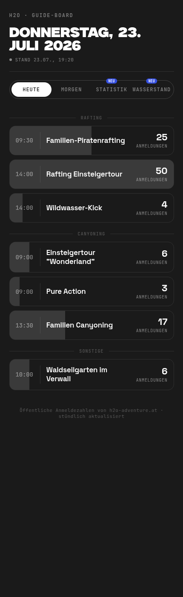
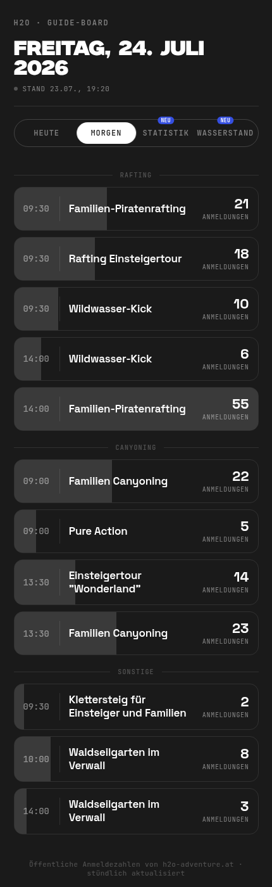
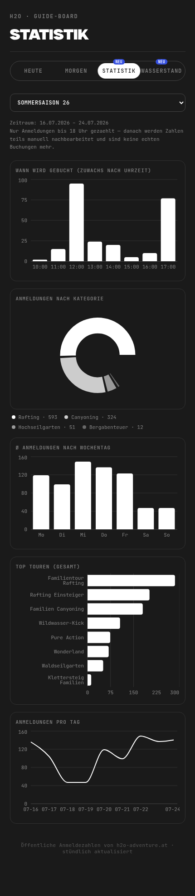
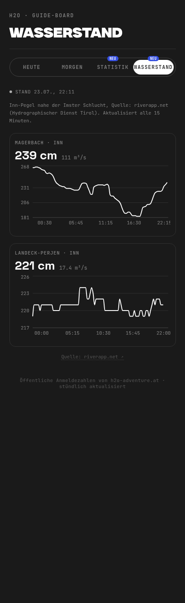
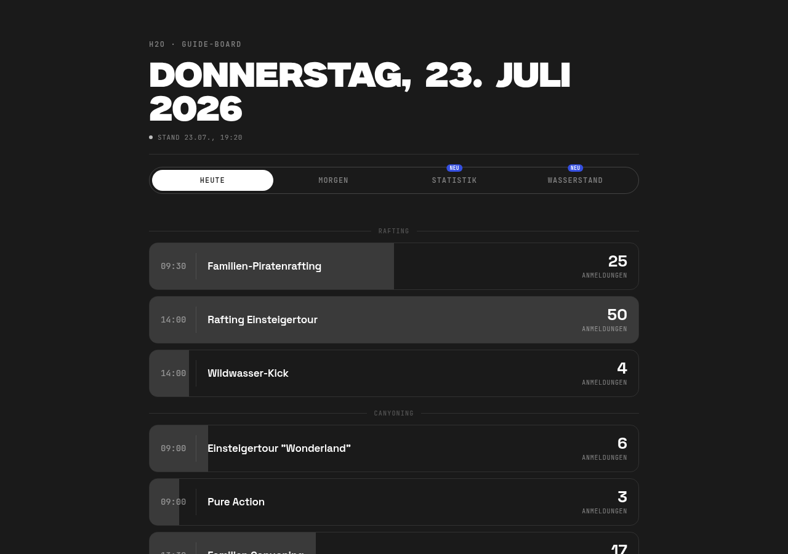

# H2O Guide-Board

A live dashboard for the guides at [H2O Adventure](https://www.h2o-adventure.at) (rafting & canyoning on the Inn river, Tyrol, Austria) — real-time booking numbers per tour, historical stats, and the current water level, all in one place.

No login, no booking-system access needed on the day: just a phone or a laptop and this page.



## What it does

- **Heute / Morgen** — every tour running today or tomorrow, sorted Rafting → Canyoning → everything else, with a live "water level" bar showing how full each tour is relative to the fullest one that day.
- **Statistik** — when do people actually book (by hour of day), which category and tour are most popular, which weekdays are busiest, and how bookings trend over the season. Only counts scrapes taken before 18:00 local time, since anything later can be manually adjusted by staff and isn't a real customer booking anymore.
- **Wasserstand** — current water level (cm) and discharge (m³/s) of the Inn near the Imster Schlucht, plus a 24h trend line per gauge, sourced from the official Tyrolean hydrographic service.

| Booking list | Statistics |
|---|---|
|  |  |

| Water level |
|---|
|  |

Works just as well on a laptop:



## How it's built

There's no backend and no database — it's a static site (Vite + React) backed by a handful of JSON files that a scheduled scraper keeps up to date. Everything the frontend fetches (`public/data/*.json`, `public/history/*.jsonl`) is generated by small Node scripts and committed straight into the repo.

```
GitHub Actions (cron)  →  scrapes / aggregates data  →  commits JSON to public/  →  Vercel redeploys
```

| Script | Runs | What it does |
|---|---|---|
| `scraper.js` | hourly, around the clock | Scrapes today's and tomorrow's tour program from h2o-adventure.at (title, category, time, location, current registrations) and appends one line per tour to `public/history/<date>.jsonl`. |
| `buildStats.js` | after every scrape | Aggregates the full history into `public/data/stats.json` — booking activity by hour, category/weekday/season breakdowns, top tours — grouped by season, cutoff at 18:00. |
| `wasserstand.js` | every 15 minutes | Pulls the current water level/discharge for two Inn gauges near the Imster Schlucht from [riverapp.net](https://www.riverapp.net) (source: Hydrographischer Dienst Tirol) and keeps a rolling 24h history. |

Two independent GitHub Actions workflows run these on their own schedules (`.github/workflows/scrape.yml`, `.github/workflows/wasserstand.yml`), since water level can change a lot faster than booking numbers and shouldn't be tied to the same cadence.

## Tech stack

- [Vite](https://vitejs.dev) + [React](https://react.dev) — frontend
- [Framer Motion](https://www.framer.com/motion/) — the animated tab pill, number transitions
- [Recharts](https://recharts.org) — all charts
- [Cheerio](https://cheerio.js.org) — HTML parsing in the scraper
- Plain Node scripts + GitHub Actions cron — the entire "backend"
- [Vercel](https://vercel.com) — hosting, redeploys automatically on every data push

Design is deliberately two-color (dark gray + white) with one small branded exception (H2O's own blue, for the "new" badges), typeset in Geist, Space Grotesk, Milker and JetBrains Mono.

## Local development

```bash
npm install
npm run dev          # starts Vite on localhost:5173
```

The dev server reads whatever is already in `public/data` — run the scripts once to get real data locally:

```bash
node scraper.js       # today + tomorrow's tours
node buildStats.js     # rebuild public/data/stats.json from the history
node wasserstand.js   # current water level + history
```

Build for production:

```bash
npm run build         # outputs to dist/
npm run preview       # serve the production build locally
```

## Deploying

The site deploys to Vercel (`vercel.json` is already set up for the Vite preset). Vercel just serves the static build — the two GitHub Actions workflows are what keep the underlying data fresh; every commit they push triggers a redeploy automatically.

## Data sources

- Tour and booking data: [h2o-adventure.at](https://www.h2o-adventure.at) (publicly visible registration counts, scraped respectfully with a delay between requests)
- Water level: [riverapp.net](https://www.riverapp.net), sourced from the Hydrographischer Dienst Tirol (Tyrolean hydrographic service)
