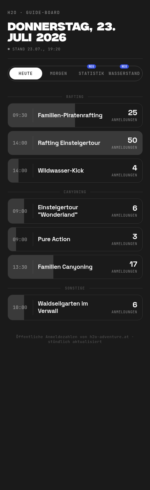
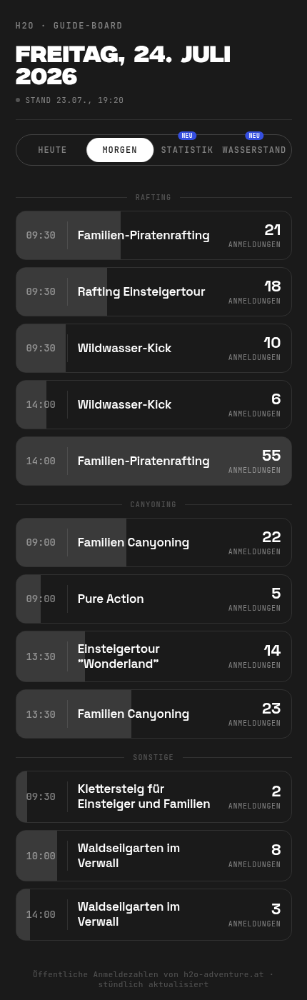
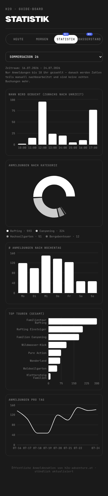
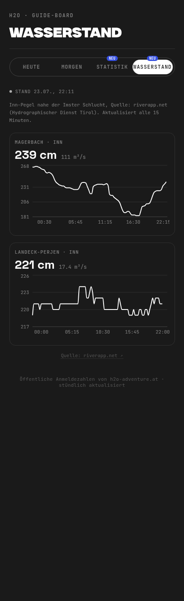
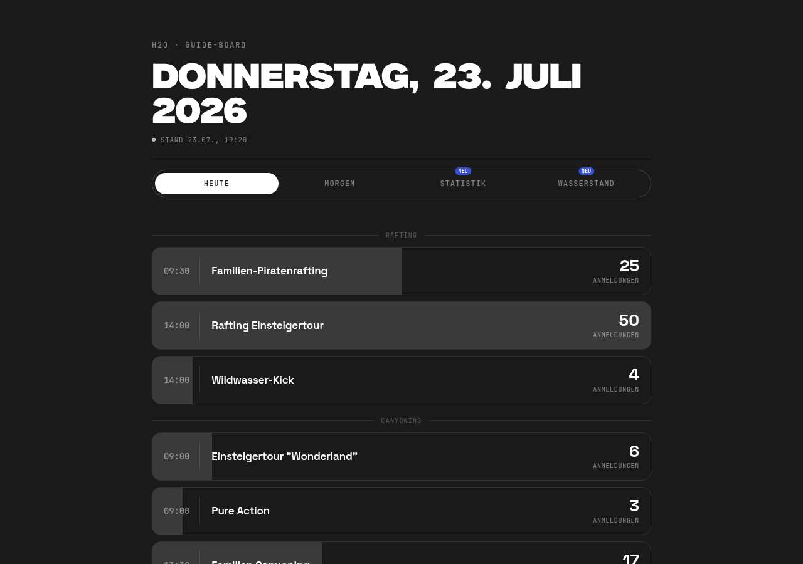

# H2O Guide-Board

A live dashboard for the guides at [H2O Adventure](https://www.h2o-adventure.at) (rafting & canyoning on the Inn river, Tyrol, Austria) — real-time booking numbers per tour, historical stats, and the current water level, all in one place.

No login, no booking-system access needed on the day: just a phone or a laptop and this page.



## What it does

- **Heute / Morgen** — every tour running today or tomorrow, sorted Rafting → Canyoning → everything else, with a live "water level" bar showing how full each tour is relative to the fullest one that day.
- **Statistik** — when do people actually book (by hour of day), which category and tour are most popular, which weekdays are busiest, and how bookings trend over the season. Only counts scrapes taken before 18:00 local time, since anything later can be manually adjusted by staff and isn't a real customer booking anymore.
- **Wasserstand** — current water level (cm) and discharge (m³/s) of the Inn near the Imster Schlucht, plus a 24h trend line per gauge, sourced from the official Tyrolean hydrographic service.
- **Aktualisieren button** — re-fetches whatever is already on the server (with a cache-busting timestamp so no stale copy is served). **It does not trigger a new scrape.** New numbers only ever come from the `worker` container's own schedule (hourly / every 15 min, see below); the button just pulls the latest already-written snapshot into the browser sooner than the next automatic reload would.

| Booking list | Statistics |
|---|---|
|  |  |

| Water level |
|---|
|  |

Works just as well on a laptop:



## How it's built

There's no database — it's a static site (Vite + React) backed by a handful of JSON files that a scheduled worker keeps up to date. Everything the frontend fetches (`/data/*.json`, `/history/*.jsonl`) lives on a Docker volume shared between two containers:

```
                    ┌───────────────────────────────┐
                    │        volume: h2o_data        │
                    │   /shared/data  /shared/history │
                    └───────────────▲────────────────┘
                       writes only  │   reads only (nginx alias)
                                    │
   worker (crond, Europe/Vienna)   │        web (nginx, static build)
   scraper.js + buildStats.js  ────┘        serves dist/ + /data/ + /history/
   hourly on the hour                       reachable via Coolify's proxy
   wasserstand.js every 15 min
```

The **worker** container never talks to Git — it just writes JSON straight to the volume, atomically (temp file + rename, see `lib/atomicWrite.js`) so the **web** container's nginx never serves a half-written file. The **web** container only ever reads that volume; it never writes to it.

| Script | Runs | What it does |
|---|---|---|
| `scraper.js` | hourly, on the hour | Scrapes today's and tomorrow's tour program from h2o-adventure.at (title, category, time, location, current registrations) and appends one line per tour to `<historyDir>/<date>.jsonl`. |
| `buildStats.js` | right after every scrape | Aggregates the full history into `<dataDir>/stats.json` — booking activity by hour, category/weekday/season breakdowns, top tours — grouped by season, cutoff at 18:00. |
| `wasserstand.js` | every 15 minutes | Pulls the current water level/discharge for two Inn gauges near the Imster Schlucht from [riverapp.net](https://www.riverapp.net) (source: Hydrographischer Dienst Tirol) and keeps a rolling 24h history. |

`<dataDir>`/`<historyDir>` are `./public/data`/`./public/history` by default (used for local dev) or `/shared/data`/`/shared/history` inside the worker container, controlled by the `H2O_DATA_DIR`/`H2O_HISTORY_DIR` env vars (see `config.js`).

> **Transition note:** the two GitHub Actions workflows (`.github/workflows/scrape.yml`, `wasserstand.yml`) that used to commit this data to Git still exist and still run — see [GitHub Actions: transition status](#github-actions-transition-status) below. They're intentionally left running until the worker is confirmed stable in production; they no longer have anything to do with what the live site actually serves once the `web`/`worker` containers are deployed, since the site now reads from the Docker volume, not from the repo.

## Tech stack

- [Vite](https://vitejs.dev) + [React](https://react.dev) — frontend
- [Framer Motion](https://www.framer.com/motion/) — the animated tab pill, number transitions
- [Recharts](https://recharts.org) — all charts
- [Cheerio](https://cheerio.js.org) — HTML parsing in the scraper
- Plain Node scripts, run on a schedule by a dedicated `worker` container (real `crond`) — the entire "backend"
- Docker + [Coolify](https://coolify.io) — hosting (self-hosted on Hetzner Cloud), `web` redeploys automatically on every push to `main`

Design is deliberately two-color (dark gray + white) with one small branded exception (H2O's own blue, for the "new" badges), typeset in Geist, Space Grotesk, Milker and JetBrains Mono.

## Local development

```bash
npm install
npm run dev          # starts Vite on localhost:5173
```

The dev server reads whatever is already in `public/data` — run the scripts once to get real data locally:

```bash
node scraper.js       # today + tomorrow's tours
node buildStats.js     # rebuild public/data/stats.json from the history
node wasserstand.js   # current water level + history
```

Build for production:

```bash
npm run build         # outputs to dist/
npm run preview       # serve the production build locally
```

## Deploying

Two containers, one shared volume, no Git involved in serving or producing data:

| File | Container | Role |
|---|---|---|
| `Dockerfile.web` | `web` | Multi-stage build (`node:20-alpine` → `nginx:alpine`). Serves the built app plus `/data/` and `/history/` as nginx `alias`es straight from the volume. SPA fallback to `index.html`. `Cache-Control: no-cache` on `/data/` and `/history/`. |
| `Dockerfile.worker` | `worker` | `node:20-alpine` + real `crond` (timezone `Europe/Vienna`). Runs the three scripts on schedule, writes only to the volume. No Git, no GitHub token, no network egress except to h2o-adventure.at and riverapp.net. |

Both are defined together in `docker-compose.yml` as a single Coolify **Docker Compose** resource, sharing the named volume `h2o_data`, mounted at `/shared` in both containers (`/shared/data`, `/shared/history`).

### Local

```bash
docker compose up --build   # web on http://localhost:8080, worker runs its own cron
```

The `ports: 8080:80` mapping on `web` in `docker-compose.yml` is only there for local testing — see the Coolify setup below for how it's actually exposed in production. `worker` publishes no ports at all; it only ever talks to the volume and the two external data sources.

### Coolify setup

1. Create **one** new resource of type **Docker Compose**, pointing at this repo's `docker-compose.yml`. Coolify will bring up both `web` and `worker` together.
2. In the resource's domain settings, point the domain at the **`web`** service, port `80`. Coolify's proxy talks to the container directly over its internal network — the `ports: 8080:80` line in the compose file is redundant in that path (harmless to leave; remove it if Coolify complains about a port clash) but is *not* how the public domain reaches the container. `worker` is never assigned a domain and has no `ports:` entry — it's unreachable from the outside by design.
3. No secrets needed. Unlike the previous Git-based cron approach, the worker needs **no GitHub token** — it only writes to the local volume.
4. Auto-deploy-on-push works normally for this resource now: a `worker` redeploy just restarts `crond` (harmless, existing volume data stays exactly as it is — see [Initialization](#initialization--data-safety) below). There's no more risk of a container redeploying *itself* every 15 minutes, because the worker no longer commits anything that would trigger a webhook.

### Schedules

Both run in the `worker` container's local time, set to `Europe/Vienna` (`TZ` env var, `tzdata` package installed) — a real `crond`, not GitHub Actions' best-effort `schedule` trigger, so these fire exactly on the minute:

- `scraper.js` + `buildStats.js`: `0 * * * *` — every hour, on the hour (e.g. exactly 09:00, 10:00, …)
- `wasserstand.js`: `*/15 * * * *` — every 15 minutes

See `worker/crontab`. DST is handled correctly (CET in winter, CEST in summer) since `TZ=Europe/Vienna` plus the `tzdata` package resolve against the same IANA timezone database that `date`/Node's `Intl` use everywhere else in this project (e.g. `config.js`'s `timezone` setting) — no manual offset math anywhere.

### Initialization & data safety

- On first start, `worker/init-volume.sh` copies the reference data baked into the worker image (`public/data`, `public/history` as of the last Git commit) into the empty volume — this is what seeds a brand-new `h2o_data` volume so the site isn't blank on day one.
- `data` and `history` are checked **independently** — if one is already populated but the other somehow isn't (e.g. a manually pruned subfolder), only the empty one gets seeded; the populated one is left untouched.
- Once a directory has data in it, this step is a no-op on every subsequent container start/redeploy — nothing already in the volume is ever overwritten or deleted, no matter how often the containers restart or redeploy.
- The named volume itself (`h2o_data`) is pinned via `name: h2o_data` in `docker-compose.yml`, so the same underlying Docker volume is always reused, even if Coolify's compose project prefix ever changes — a redeploy never creates a new, empty volume by accident.
- All JSON writes (`scraper.js`, `buildStats.js`, `wasserstand.js`) go through `lib/atomicWrite.js`: write to a temp file **in the same directory** as the target (so `rename()` stays on one filesystem and is guaranteed atomic per POSIX), then `rename()` it over the target. nginx in the `web` container can never serve a half-written file, even if it reads mid-write.

### Manually testing a worker run

```bash
docker compose exec worker sh -c "npm run wasserstand"
docker compose exec worker sh -c "npm run scrape && npm run stats"
```

Or trigger exactly what cron would run, including its logging wrapper:

```bash
docker compose exec worker /app/worker/run-job.sh wasserstand sh -c "npm run wasserstand"
```

### Checking logs

```bash
docker compose logs -f worker   # cron job start/OK/FEHLER lines, from run-job.sh
docker compose logs -f web      # nginx access/error log
```

`worker`'s crontab redirects each job's output to the container's own stdout/stderr (`/proc/1/fd/1`/`2`, since `crond -f` runs as PID 1), so everything shows up in `docker logs`/Coolify's log viewer — no mail spool or syslog to dig through. A failed run logs `[<job>] FEHLER (exit <code>) <timestamp>` but always exits `0`, so it never stops `crond` or crash-loops the container.

### Healthchecks

- **`web`**: `wget -qO- http://127.0.0.1:80/` from inside the container — a real HTTP request against the nginx process on the port it actually serves, not just "is the container running".
- **`worker`**: `worker/healthcheck.sh` checks two things, not just one — `pgrep crond` (the daemon is up) *and* that `/tmp/h2o-worker-heartbeat-wasserstand` (touched by `run-job.sh` on every successful run) is younger than 20 minutes. Since `wasserstand.js` runs every 15 minutes, a stale heartbeat past 20 minutes means a job is actually failing or stuck, not just "crond exists but nothing's succeeding". `start_period: 20m` in `docker-compose.yml` gives the very first cron tick after a fresh start room to happen before failing checks count against the container.

### Backup & restore of the volume

Backup (from the host, while the containers keep running — reads are non-blocking against atomic writes):

```bash
docker run --rm -v h2o_data:/shared -v "$PWD":/backup alpine \
  tar czf /backup/h2o_data_$(date -u +%Y-%m-%dT%H-%M-%SZ).tar.gz -C /shared .
```

Restore into a (new or emptied) volume:

```bash
docker run --rm -v h2o_data:/shared -v "$PWD":/backup alpine \
  sh -c "cd /shared && tar xzf /backup/<file>.tar.gz"
```

Coolify manages the named volume like any other Docker volume — it survives redeploys and container recreation by default, but isn't automatically backed up externally, so keep an occasional snapshot using the command above if the data matters beyond what GitHub Actions' Git history (below) already retains.

### GitHub Actions: transition status

`.github/workflows/scrape.yml` and `wasserstand.yml` still run on their original schedule and still commit to `public/data`/`public/history` in Git — they're deliberately left as-is for now, running in parallel with the worker, as a safety net and a Git-history backup of the data. They no longer feed the live site once `web`/`worker` are deployed (the site reads the Docker volume, not the repo), so this is redundant data production, not a conflict — nothing to reconcile, no double-write hazard.

**Do not disable them yet.** Once the worker has been running in production long enough to trust it (recommendation: at least a few days, checked via the logs above), remove the `schedule:` block from both workflow files (keep `workflow_dispatch` as a manual fallback) — each file has a comment marking exactly where. That's a deliberate follow-up step, not something to do automatically after this change.

## Data sources

- Tour and booking data: [h2o-adventure.at](https://www.h2o-adventure.at) (publicly visible registration counts, scraped respectfully with a delay between requests)
- Water level: [riverapp.net](https://www.riverapp.net), sourced from the Hydrographischer Dienst Tirol (Tyrolean hydrographic service)
